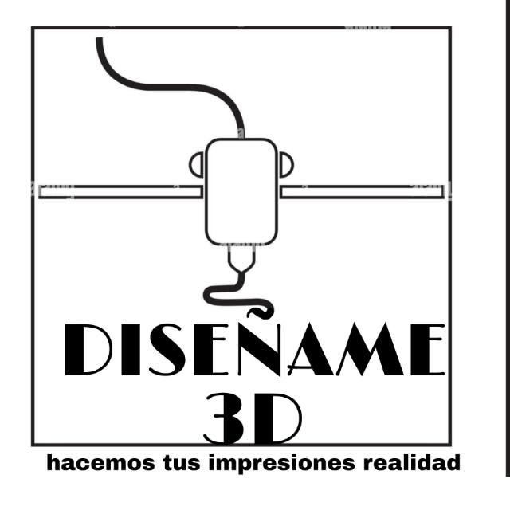

# ***PROYECTO INTEGRADOR - GRUPO 01 - COMISION 15***

# ***DISEÑAME 3D***

<p style = 'text-align:center;'>

</p>


### **DESCRIPCION DEL SERVICIO**
```
Impresiones de piezas personalizadas acorde a la nececidad del cliente,trabajamos con distintos tipos de materiales entre los mas usados:
```
* PLA
* ABS
* TPE
* impresiones con aluminio
```
Creamos piezas de distintos tamaños y funcionalidades , tanto mecanicas como estaticas , tenemos piezas en stock , los pedidos se hacen por mensaje directo con personal capacitado  , es de venta a todo el publico .
```

## **INTEGRANTES**
---
___JOSE RAMOS___

```
Mi nombre es Ramos Soto Jose Ezequiel, tengo 23 años necido en Tierra Del Fuego e Islas Del Atlantico sur en la ciudad de Rio Grande, me mude a la provincia de Neuquen en febrero de 2015 en busca de una mejor oportunidad academica , me recibi en 2020 con el titulo de tecnico mecanico de la epet n°10 .
Mis intenciones al entrar en el curso de programacion es un futuro laboral y tener una base de inciar una carrera que me fascina , ingrese sin tener una idea de lo que era programacion pero ahora mas que nunca quiero terminar de aprender esta profesion y dedicarme a ella , y si es posible aprender los distintos caminos que te puede llevar esta profesion . 
```
___THAIEL HERNANDEZ___

```
Resido en la ciudad de Cutral-Co Neuquen Argentina; en la cual me forme como Maestro Mayor de Obra.
Actualmente me encuentro cursando "programacion wed Full Stack" curso becado que ofrece Formar Argentina.
mi objetivo es ampliar mis conocimientos para insertarme en el mundo laboral de la programacion.
```
***GEREMIAS ZALOKAR***

```
Soy de cutral co Neuquen Argentina, un estudiante de 19 anios en licenciatura en ciencias de la computacion.
Quede en el curso de programacion wed fullStack que ofrece Formar Argentina. Mi interes con este curso es agrandar mis horizontes de conocimientos para en algun momento en el futuro poder insertarme en el mercado y asi poder trabajar, vivir de lo que quiero. Me interesa mucho mas el back-end
```
***JUAN EDUARDO LICCIARDI***

```
Nacido en la ciudad de General Roca, Provincia de Rio Negro, el 02 de octubre de 1976, recibido en 1995 como Tecnico en Computación con orientación a la programación de la Escuela Nacional de Educación Técnica N° 01 de General Roca.- 
Recide en la comarca petrolera de Cutral Co - Plaza Huincul de la provincia del Neuquén desde 1997, su familia se conforma de su esposa y dos hijos adolescentes.- 
Actualmente es empleado del Poder Judicial de la provincia de Neuquén desempeñandose en el escalafon Ordenanza.-
Se postulo para el curso que brida el grupo Formar Argentina, en el cual quedo seleccionado y se encuentra realizando curso de Programador Web Full Stack, capacitación con la cual pretende ingresar al mundo laboral de la programación, es de su interes el desarrollo en Back end.-  
```
